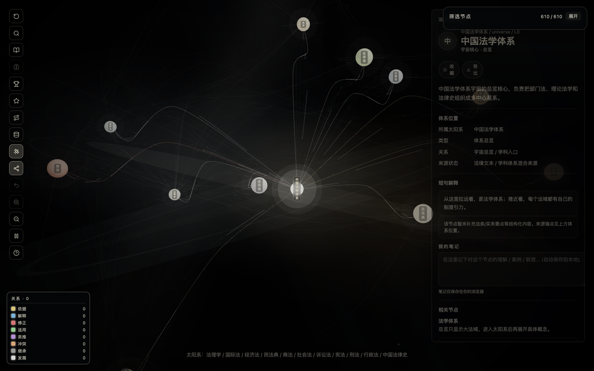

# 法脉星河 · Famai Star Map

**把自己的法律学习资料，连接成可探索的 3D 知识星图。**

导入讲义或粘贴笔记，用自己的 AI 服务抽取概念、关联不同资料，再核查整理并导出学习报告。

[](https://github.com/pallwalt/famai-star-map/actions/workflows/ci.yml)

[English](README.en.md) · [快速开始](#快速开始) · [合成示例](examples/README.md) · [贡献指南](CONTRIBUTING.md)


**无需账号，浏览预置星图无需 API Key。** AI 分析和报告使用你配置的服务，由该服务商计费。界面与预置内容以中文为主，底图包含 **610 个节点、969 条关系、11 个学习星系**。

## 为什么做这个项目

法律学习中的知识常散落在讲义、笔记和案例摘录里。法脉星河尝试把“这是什么概念”“属于哪个领域”“与另一份资料有什么关系”放在同一张图里，帮助你建立自己的学习结构。

你带来资料和 AI 服务，项目负责整理与可视化；来源核查与判断仍由你完成。

## 快速开始

需要 Node.js 20.19+（20.x）或 22.12+、npm 10+；推荐版本见 [.nvmrc](.nvmrc)。

```bash
git clone https://github.com/pallwalt/famai-star-map.git
cd famai-star-map
npm ci
npm run dev
```

打开终端提示的本地地址，默认 [http://localhost:5173](http://localhost:5173)。也可以在 GitHub 的 **Code → Download ZIP** 下载后解压运行。

1. 关闭首次引导，直接浏览预置星图。
2. 点击一个学习星系，再选择概念查看关联。
3. 按 `Cmd/Ctrl + K` 搜索，例如“正当防卫”；按 `Esc` 返回总览。

## 用自己的资料建立星图

1. 打开左侧数据库图标 **个人工作台**，填写 AI 的 **Base URL、Model、API Key**。
2. 导入 [合同学习样例](examples/contract-learning.md) 和 [学习笔记样例](examples/study-notes.txt)，或直接粘贴自己的资料。
3. 点击 **分析待处理资料**。长文分块处理，概念归入对应学习星系，并结合已有概念推断跨资料关系。
4. 对照原文检查摘要、分类和关系；可编辑、合并概念，并用审核标记记录核查状态。
5. 在 **综合学习报告** 中选择已分析资料，生成报告后点击 **下载 Markdown**。

支持 TXT、Markdown 和可提取文字的 PDF。扫描件需要先做 OCR。导入时仅保存到当前浏览器，主动分析时才发送相关内容。

### 如何填写 AI 设置

| 字段 | 填写方式 |
|---|---|
| Base URL | OpenAI 兼容 API 的根地址，例如 `https://api.openai.com/v1`，不要附加 `/chat/completions` |
| Model | 服务商实际支持、能稳定返回结构化 JSON 的模型 ID |
| API Key | 你自己的密钥；默认不勾选“记住” |

服务需支持浏览器跨域请求（CORS）和 `/chat/completions`。支持 HTTPS 服务及本机 localhost HTTP 服务；本机免鉴权服务可填 `local` 作为占位 Key。项目不提供密钥、额度或服务端代理，也不保证任意兼容服务均可直接使用。

## 可以做什么

- **探索知识关系**：3D 星图、概念搜索、学习路径、收藏与笔记。
- **整理个人资料**：导入或粘贴、自动分块分析、跨资料关系推断、人工审核。
- **修正 AI 结果**：编辑关系、调整归类、合并同名概念及撤销操作。
- **带走学习成果**：Markdown 学习报告、Obsidian 导出、JSON 完整备份。
- **反复复习**：本地模板练习、错题本与间隔重复。模板题不是官方考试题库。



## 数据、隐私与边界

- 原文和学习记录存储在当前浏览器；没有云账号、云备份或自动跨设备同步。
- Key 默认仅存于当前页面内存，刷新即清除。主动选择记住后才写入本地 IndexedDB，**未加密**；JSON 备份不含 Key。
- 分析时，资料文本及相关已有概念会发送到你指定的服务；报告使用所选资料的既有抽取摘要、关系及引用，不重新核验原文。
- 项目不主动发送遥测；托管平台与所选 AI 服务仍可能保留各自的访问记录。
- 每份资料最多 20 万字符，文字 PDF 文件最多 100 MB；单块最多 12,000 字符。已有概念上下文和报告摘要另有大小限制，过长会明确提示。
- 清理站点数据可能丢失资料。请在工作台导出 JSON 备份；学习报告不能替代完整备份。

**本项目用于学习，不构成法律意见。** 预置内容覆盖尚不完整，部分节点仍待补充来源；AI 也可能错误归类、建立不当关系或生成不准确引用。欢迎补充可核查的官方来源，不应把图谱或报告作为已经核实的法律结论。

[隐私说明](docs/PRIVACY.md) · [安全说明](docs/SECURITY.md) · [使用边界](docs/TERMS.md) · [验收记录](docs/OPEN-SOURCE-READINESS.md)

## 开发与部署

React 18 · TypeScript · Vite · Three.js / React Three Fiber · IndexedDB · PDF.js

```bash
npm run verify:all    # 类型、lint、数据、单测、构建、SW 与对比度检查
npm run test:scripts
npx playwright install chromium
npm run test:e2e
npm run build        # 产物位于 dist/
```

可静态托管。GitHub Pages 支持项目子路径，Deploy 工作流需要手动运行，推送代码不会自动发布网站。详见 [部署指南](docs/DEPLOYMENT.md)。

浏览器测试使用合成 Key 和模拟 AI 响应，不能替代真实服务的配置、费用与输出质量验证。

## 一起改进

欢迎提交可复现的问题和范围清晰的 PR，尤其是：

- 补充预置节点的官方来源与准确说明。
- 改进手机端、键盘操作和屏幕阅读器体验。
- 用合成资料记录兼容 API 的实际表现。
- 完善英文说明及未来的界面国际化。

请不要在 Issue、截图或测试资料中放入真实 Key、私密案件资料或个人信息。开始前请看 [贡献指南](CONTRIBUTING.md)。如果这个项目对你有帮助，欢迎 Star，或分享你的学习用法。

## 许可与源码边界

采用 [AGPL-3.0](LICENSE)。第三方依赖遵循各自许可。

发布工具 `npm run package:source` 从当前文件生成源码包及 SHA-256 清单，排除依赖、构建产物、内部记录、环境文件与参考素材。旧开发历史未作为本次公开内容；维护者重新发布时应检查清单，不要把未经审查的旧历史或第三方资料加入公开仓库。

视觉灵感来自人物关系星图；公开包中的截图来自本项目界面，示例资料为本项目编写的合成教学材料。
